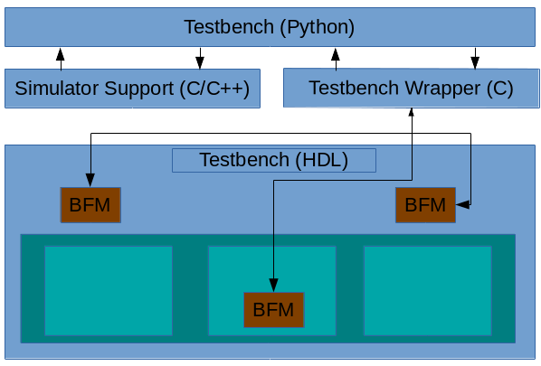
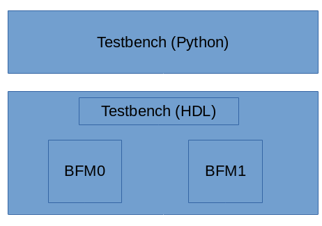

# Py-HPI

The Python HDL Procedural Interface (py-HPI) implements a mechanism for Python scripts and
HDL (SystemVerilog and eventually Verilog, VHDL) to interact at the procedural level. 
This means that Python can call SystemVerilog tasks, and SystemVerilog can call
Python methods. Interacting at the procedural level enables support for a broader set of
execution environments (simulators), supports a broader range of integration styles, 
and provides higher performance than does integration at the signal level. 

# Theory of Operations

<center>

</center>

The general structure of a Py-HPI testbench is shown above. All of the elements above are
part of the simulation process at runtime.
- The Python testbench is written by the user and uses the Py-HPI library.
- The Simulator Support code is generated by Py-HPI and, depending on the simulator, may be specific to the HDL being simulated
- The Testbench Wrapper code is generated by Py-HPI and is specific to BFMs present in the HDL being simulated
- The Python testbench interacts with the HDL at the procedural level via bus functional models (BFMs) that are instanced in the HDL testbench and design

# Example
It's useful to see how all the pieces fit together via an example. 
The example shown here is located in the [ve/unit/bfm](https://github.com/fvutils/py-hpi/tree/master/ve/unit/bfm) subdirectory.

<center>

</center>

A block diagram of the example is shown above. The HDL testbench 
contains two very simple BFMs that interact at the signal level
with the HDL in the testbench. The Python portion of the testbench
calls the BFMs in the HDL to interact with the design. 

Let's walk through the steps needed to compile this example using
Verilator. Please note that the 'hpi' package in the script commands
below is the main package of Py-HPI. These commands are in the
[runit_vl.sh](https://github.com/fvutils/py-hpi/tree/master/ve/unit/bfm/runit_vl.sh)
script inside the example directory.

```sh
python3 -m hpi gen-launcher-vl top -clk clk=1ns 
```
First, we generate the simulation support code using Py-HPI. 
The Verilator simulator-support code needs to know the 
name of the top HDL module (top) and about the clock
input (clk) and period (1ns).

```sh
python3 -m hpi -m my_tb gen-bfm-wrapper simple_bfm -type sv-dpi
python3 -m hpi -m my_tb gen-dpi
```

Next, we generate the BFM wrapper code for the simple_bfm, and
the testbench integration. Note that in both cases, we specify
that the user's Python testbench module (my_tb) be loaded so 
that the generation commands have access to the definition of
the testbench and BFMs.

```sh
# Query required compilation/linker flags from Python
CFLAGS="${CFLAGS} `python3-config --cflags`"
LDFLAGS="${LDFLAGS} `python3-config --ldflags`"

verilator --cc --exe -Wno-fatal --trace \
	top.sv simple_bfm.sv \
	launcher_vl.cpp pyhpi_dpi.c \
	-CFLAGS "${CFLAGS}" -LDFLAGS "${LDFLAGS}"

make -C obj_dir -f Vtop.mk

```

Next, we need to compile the HDL testbench, simulator-support
code, and testbench-wrapper code with Verilator. Because
we are instructing Verilator to compile C/C++ code, we must
provide the appropriate compilation and linking options using
the -CFLAGS and -LDFLAGS switches to Verilator.

When Verilator runs, it creates a directory containing sources
and Makefiles. The final command runs the Makefile in the 
output directory to build the simulation executable.

```sh
./obj_dir/Vtop +hpi.load=my_tb +vl.timeout=1ms +vl.trace
```

Finally, we can execute the simulation image. In this case,
we are specifying that the simulation will run for 1ms at most,
and will generate a waveform trace.


# Details

## BFMs

There are two pieces to a pyHPI BFM: the Python side and the HDL side. The Python side
consists of a Python class with specific 
[decorators](https://realpython.com/primer-on-python-decorators/) to identify key 
elements of the BFM class. The HDL side consists of SystemVerilog source 
(or Verilog/VHDL in the future) that translates between procedure calls to 
signal-level activity, and vice versa.

### Python
The Python side of a pyHPI BFM is implemented with a Python class. Three decorators
are used to identify key elements within the BFM:
- The BFM itself (@hpi.bfm)
- Import methods (@hpi.import_task) -- methods provided by Python and called by the HDL
- Export methods (@hpi.export_task) -- methods provided by the HDL and called by Python

Here's a short example of a BFM:

```py3
@hpi.bfm
class simple_bfm():
    
  def __init__(self):
    self.ack_sem = hpi.semaphore()

  def xfer(self,data):
    self.req(data)
    self.ack_sem.get(1)

  @hpi.export_task("i")
  def req(self, data : int):
    pass

  @hpi.import_task()
  def ack(self):
    self.ack_sem.put(1)
```

#### Parameter-Type Annotations
Python is a dynamically typed language. However, it is important to know the precise
type of parameters being passed to/from HDL. This information is provided via the
argument passed to the _import_task_ and _export_task_ decorators. The type of 
each method parameter is specified with one or two characters:

- **s** - String
- **i** - Signed 32-bit integer parameter
- **iu** - Unsigned 32-bit integer parameter
- **l** - Signed 64-bit integer parameter
- **lu** - Unsigned 64-bit integer parameter


- Python Side
  - Registration of class
  - Registration of methods

### HDL
The HDL side of a BFM is responsible for converting procedure calls from Python to signal activity and vice versa. 
Currently, Py-HPI supports SystemVerilog. Details on other languages integrations will be added as they are
developed.

#### SystemVerilog

```sv
module simple_bfm(
    input             clk,
    output reg        req_o,
    output reg [7:0]  data,
    input             ack);

    bit req_r = 0;
    bit[7:0] data_r = 0;

    always @(posedge clk) begin
        req_o <= req_r;
        data <= data_r;
    end
    
    // BFM instance registration
    int m_id;
    import "DPI-C" context function int simple_bfm_register(string path);
    initial begin
        m_id = simple_bfm_register($sformatf("%m"));
    end

    task simple_bfm_req(int data);
        req_r = 1;
        data_r = data;
    endtask
    export "DPI-C" task simple_bfm_req;

    import "DPI-C" context task simple_bfm_ack(int id);

    always @(posedge clk) begin
        if (req_o && ack) begin
            // Remember that new requests can 
            // occur as a side effect of the ack
            req_r = 0;
            simple_bfm_ack(m_id);
        end
    end
        
endmodule
```

The SystemVerilog portion of a BFM can be placed either in a module or an interface.

Each BFM instance must register itself by calling an imported function named
*bfm_type*_register and passing the instance path for the BFM. The registration
function returns an id that is used with subsequent calls to imported tasks.

```sv
    // BFM instance registration
    int m_id;
    import "DPI-C" context function int simple_bfm_register(string path);
    initial begin
        m_id = simple_bfm_register($sformatf("%m"));
    end
```

The registration code is shown above.
  
A task implemented by the SystemVerilog side must be tagged as a DPI-C export. The name
of the task must be *bfm_type*_*method_name*. 

```sv
    task simple_bfm_req(int data);
        req_r = 1;
        data_r = data;
    endtask
    export "DPI-C" task simple_bfm_req;
```
The code shown above is the SystemVerilog task implementation that corresponds to
the python method shown below.

```py3
  @hpi.export_task("i")
  def req(self, data : int):
    pass
```

A task implemented by the Python side must be tagged as a DPI-C import. The name of the 
task must be *bfm_type*_*method_name*. 

```sv
    import "DPI-C" context task simple_bfm_ack(int id);
```

The SystemVerilog code above shows declaration of task that corresponds to the Python
method below. Note that the SystemVerilog task accepts an 'id' parameter as the first
parameter. This parameter identifies the BFM instance, and is not passed to the 
Python method.

```py3
  @hpi.import_task()
  def ack(self):
    self.ack_sem.put(1)
```

## Python testbench
The most important element of the Python side of a Py-HPI testbench is the 
entry point. This is a Python method that acts as the 'main' of the Python
testbench. This method is decorated with an @hpi.entry decorator, which 
enables Py-HPI to report the available entry points in a given testbench
environment.

```py3
@hpi.entry
def run_my_tb():
    print("run_my_tb - bfms: " + str(len(hpi.rgy.bfm_list)))

    with hpi.fork() as f:
      f.task(lambda: thread_func_1());
      f.task(lambda: thread_func_2());

    print("end of run_my_tb");
```

The entry point method is executed in a thread, which allows the thread
to interact in a blocking manner with the HDL environment.

### Testbench API (TODO)
- Access to plusargs  
- BFM registry
- Threading API
  - Thread create
  - Semaphore (semaphore)
  - Objection mechanism

## Simulator Support (Launcher)

### Standard SystemVerilog DPI Simulator (eg Modelsim)

### Verilator


## Testbench Wrapper

### SystemVerilog DPI


## Running Simulation

### Common options
- **+hpi.entry=*method*** - Specifies the entry point method for Py-HPI
- **+hpi.load=*module*** - Specifies that Py-HPI should load a specific module or package

### Standard SystemVerilog DPI Simulator

### Verilator
- **+vl.trace[=*filename*]** -- Enables trace generation
- **+vl.timeout=*time*** -- Specifies the maximum amount of time to run in s,ms,us,ns (eg 1ms)


# Command Reference
Py-HPI provides several commands for generating simulation support and testbench wrappers.

**TODO: ** Needs documentation

## Wrapper Generation

# Launcher
- Command-line arguments
- Specification of python paths
- Loading of Python modules
- Entry point (?) 

